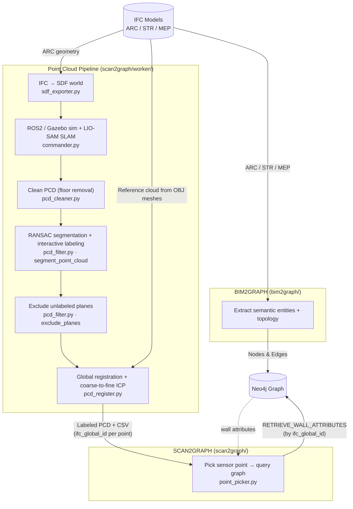

# BIM 3D Scene Graph

## Overview

BIM 3D Scene Graph constructs a semantically rich 3D scene graph by fusing BIM data and sensor-derived point clouds into a Neo4j graph database.

The project is composed of two main pipelines:

| Module | Purpose |
|---|---|
| `bim2graph` | Parse IFC models (ARC/STR/MEP) and persist a semantic graph to Neo4j |
| `scan2graph` | Generate or load a point cloud, label and register it against IFC geometry, and query the BIM graph from a picked sensor point |

Both pipelines are orchestrated from `main.py` and share a common `QueryManager` and `Neo4jOperations` layer.

---

## Module Structure

```
bim3dscenegraph/
├── main.py                     # Top-level entrypoint: Neo4j driver, runs both pipelines
├── logger.py                   # Shared file logger (phase-tagged, writes to log/project.log)
├── bim2graph/                  # BIM -> Neo4j graph pipeline
│   ├── graph_builder.py        # Orchestrator: bim2graph()
│   ├── worker/                 # Buildings, storeys, spaces, walls, layers, openings, MEP extraction
│   │   └── util/               # Geometry, wall/material, MEP shape, relationship helpers
│   ├── persistence/            # Neo4jOperations: upserts and edge creation
│   └── README.md               # Full breakdown of the BIM2GRAPH pipeline
├── scan2graph/                 # Scan -> point cloud -> BIM graph query
│   ├── graph_builder.py        # Orchestrator: scan2graph()
│   ├── worker/                 # SDF export, PCD cleaning, segmentation, registration, picking
│   │   ├── commander/          # ROS2/Gazebo pipeline control
│   │   └── util/               # Open3D IO, RANSAC planes, ICP + metrics, mesh/SDF helpers
│   ├── ifc2pointcloud/         # ROS2 workspace (submodule): Gazebo world, Velodyne sim, LIO-SAM
│   ├── persistence/            # Neo4jOperations: graph reads
│   └── README.md               # Full breakdown of the SCAN2GRAPH pipeline
├── query_manager/              # Shared Cypher query loader
│   ├── query_manager.py        # QueryManager: loads named queries from the .cypher file
│   └── query_handler.cypher    # Named Cypher statements (BIM2GRAPH + SCAN2GRAPH sections)
├── docs/                       # Architecture, data transformation, and evaluation notes
├── ifc_models/                 # Input IFC files (ARC, STR, MEP)
├── pcd_models/                 # Input/output PCD files, label CSVs, transform YAML
└── log/                        # Run log (project.log)
```

---

## System Architecture



### Step 1 — BIM2GRAPH

Reads ARC (+ optional STR, MEP) IFC files, extracts semantic entities and topology, and persists nodes and relationships to Neo4j.

Entrypoint call:
- `bim2graph(driver, arc_path, str_path=None, mep_path=None, logger=None)`

See [bim2graph/README.md](bim2graph/README.md) for the full breakdown.

### Step 2 — SCAN2GRAPH

Takes a PCD file and the same ARC IFC model. If point cloud data is not yet available, it generates one via a Gazebo simulation using the IFC geometry, then runs LIO-SAM SLAM. The resulting cloud is cleaned, segmented by RANSAC plane detection, interactively labeled against IFC walls, and registered to the IFC-derived reference cloud. Finally, the user picks a sensor point and its `ifc_global_id` is used to query the BIM graph in Neo4j.

Per-stage quality metrics (cleaning, segmentation, labeling, registration) are reported to the log under the `VALIDATION` phase.

Entrypoint call:
- `scan2graph(driver, pcd_path, arc_path, logger=None)`

See [scan2graph/README.md](scan2graph/README.md) for the full breakdown.

---

## Data/Query Layer

Cypher queries are stored in:
- `query_manager/query_handler.cypher`

Loaded dynamically by:
- `query_manager/` (shared `QueryManager`)

Executed by:
- `bim2graph/persistence/neo4j_ops.py` (writes: reset, schema, upserts, edges)
- `scan2graph/persistence/neo4j_ops.py` (reads: wall attribute retrieval)

---

## How to Run

### Prerequisites

- Python 3.10+
- Neo4j running locally (or remote)
- `ifcopenshell`, `open3d`, `numpy`, `pandas`, `pyyaml`, `python-dotenv`, `neo4j` Python packages
- ROS2 Humble + Gazebo (required only for point cloud generation step)

### Configuration

Create a `.env` file in the project root:

```
NEO4J_URI=neo4j://localhost:7687
NEO4J_USER=neo4j
NEO4J_PASSWORD=your_password
```

Set IFC and PCD paths in `main.py`:

```python
ARC_PATH = Path("ifc_models/test/test_ARC.ifc")
STR_PATH = Path("ifc_models/test/test_STR.ifc")
MEP_PATH = Path("ifc_models/test/test_MEP.ifc")
PCD_PATH = Path("pcd_models/cloudGlobal.pcd")
```

### Run

```bash
python main.py
```

The pipeline will:
1. Connect to Neo4j
2. Run BIM2GRAPH — parse IFC files and populate the graph
3. Prompt whether to run SCAN2GRAPH — process the point cloud and query the graph
4. Close the Neo4j driver

Logs are written to `log/project.log`.

Neo4j browser: `http://localhost:7474/browser/`
