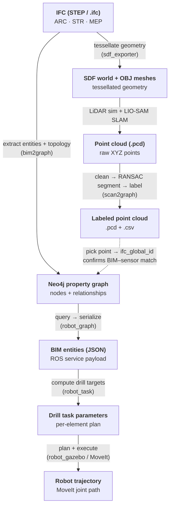

# Data Representation Across the Pipeline

How the building data changes form at each stage — from the source IFC model, through
the Neo4j semantic graph, into a 3D point cloud, and finally into executable robot motion.
Each node shows the **data format** and its role; edge labels name the transform
(and the module that performs it).

## Summary of representations

| # | Representation | Format | Produced by |
|---|---|---|---|
| 1 | Source BIM | `IFC` (STEP) | — (input) |
| 2 | Semantic graph | Neo4j property graph | `bim2graph` |
| 3 | Simulation world | `SDF` + `OBJ` | `sdf_exporter` |
| 4 | Raw point cloud | `PCD` (XYZ) | LiDAR sim + LIO-SAM |
| 5 | Labeled point cloud | `PCD` + `CSV` | `scan2graph` |
| 6 | Robot-facing BIM | `JSON` | `robot_graph` |
| 7 | Task plan | drill parameters | `robot_task` |
| 8 | Motion | MoveIt trajectory | `robot_gazebo` |
