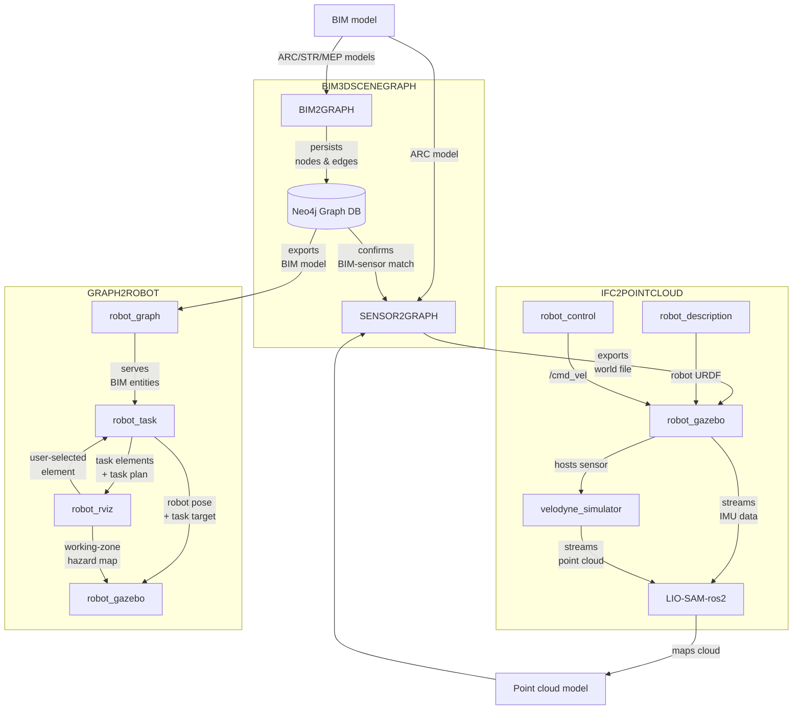

```mermaid
flowchart TB
    BIM["BIM model"]

    subgraph BIM3DSG["BIM3DSCENEGRAPH"]
        BIM2GRAPH
        SENSOR2GRAPH
        Neo4j[("Neo4j Graph DB")]
    end
    
    subgraph I2PC["IFC2POINTCLOUD"]
        GAZEBO1["robot_gazebo"]
        robot_description
        robot_control
        velodyne_simulator
        LIO-SAM-ros2
    end

    subgraph G2R["GRAPH2ROBOT"]
        robot_graph
        robot_task
        robot_rviz
        GAZEBO2["robot_gazebo"]
    end

    PCD["Point cloud model"]

    BIM --> |ARC/STR/MEP models| BIM2GRAPH
    BIM --> |ARC model| SENSOR2GRAPH
    BIM2GRAPH --> |persists </br>nodes & edges| Neo4j
    Neo4j --> |confirms </br>BIM-sensor match| SENSOR2GRAPH

    SENSOR2GRAPH --> |exports </br>world file| GAZEBO1
    robot_description --> |robot URDF| GAZEBO1
    robot_control --> |/cmd_vel| GAZEBO1
    GAZEBO1 --> |hosts sensor| velodyne_simulator
    GAZEBO1 --> |streams </br>IMU data| LIO-SAM-ros2
    velodyne_simulator --> |streams </br>point cloud| LIO-SAM-ros2
    LIO-SAM-ros2 --> |maps cloud| PCD
    PCD --> SENSOR2GRAPH

    Neo4j --> |exports </br>BIM model| robot_graph
    robot_graph --> |serves </br>BIM entities| robot_task
    robot_task --> |task elements </br>+ task plan| robot_rviz
    robot_task --> |robot pose </br>+ task target| GAZEBO2
    robot_rviz --> |user-selected </br>element| robot_task
    robot_rviz --> |working-zone </br>hazard map| GAZEBO2
```